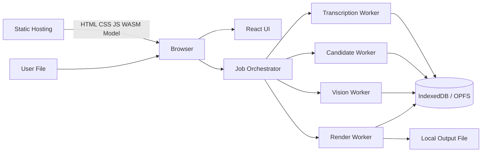
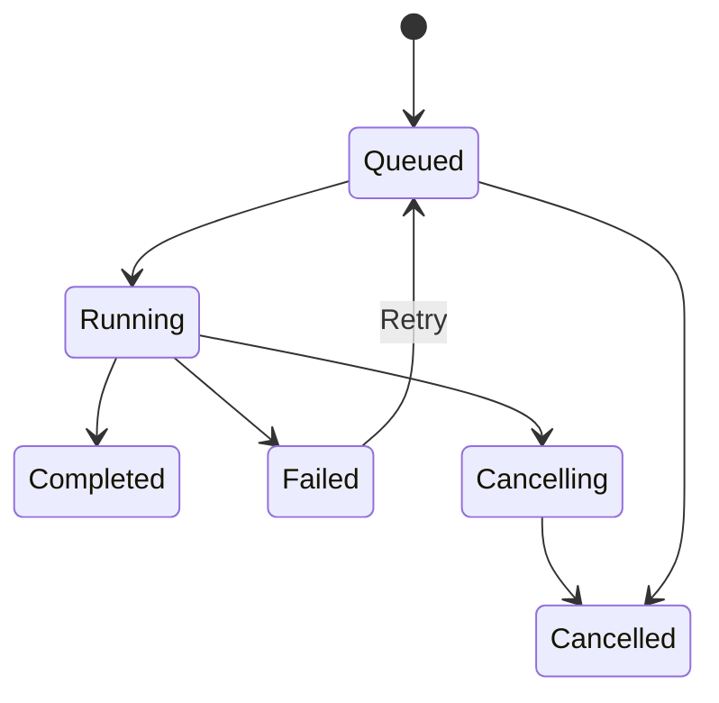
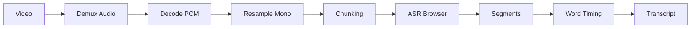
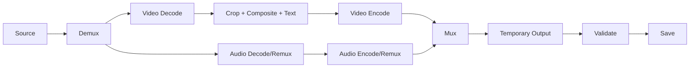

# EditFlow Auto Clipper — Dokumentasi Gabungan

> Gunakan file terpisah untuk pengembangan. File ini disediakan agar seluruh dokumen mudah dibaca dalam satu tempat.


---

<!-- SOURCE: README.md -->

# EditFlow Auto Clipper

Dokumentasi lengkap untuk membangun aplikasi web **browser-only** yang mengubah video panjang menjadi beberapa kandidat video pendek vertikal.

## Keputusan Utama

| Bagian | Keputusan |
|---|---|
| Bentuk produk | Website online statis |
| Pemrosesan | Lokal di laptop pengguna |
| Upload video ke server | Tidak ada |
| VPS pemrosesan | Tidak diperlukan |
| Target awal | Chrome dan Edge desktop |
| Input MVP | File video lokal |
| Hasil | Beberapa kandidat clip |
| Alur | Analisis → preview → edit → render |
| Template utama | Smart Editorial |
| Transkripsi | Model Whisper di browser |
| Deteksi wajah | Model vision di browser |
| Preview | Video asli + overlay |
| Render final | WebCodecs + media muxer |
| Penyimpanan | IndexedDB, OPFS, dan file lokal |

> Gunakan hanya video milik sendiri, video berlisensi, atau video yang sudah mendapat izin. Fitur pengunduh video dari platform pihak ketiga tidak termasuk dalam MVP.

## Alur Produk

```text
Buka website
→ pemeriksaan browser dan perangkat
→ pilih video dari laptop
→ atur jumlah kandidat, durasi, bahasa, dan layout
→ transkripsi lokal
→ pembuatan banyak kandidat
→ analisis wajah dan ruang kosong
→ preview kandidat
→ koreksi start/end, crop, subtitle, headline
→ pilih kandidat
→ render lokal
→ simpan MP4
```

## Dokumen

- [PRD.md](./PRD.md)
- [SCOPE_AND_REQUIREMENTS.md](./SCOPE_AND_REQUIREMENTS.md)
- [USER_FLOW.md](./USER_FLOW.md)
- [UI_UX_SPEC.md](./UI_UX_SPEC.md)
- [ARCHITECTURE.md](./ARCHITECTURE.md)
- [TECH_STACK.md](./TECH_STACK.md)
- [PROJECT_STRUCTURE.md](./PROJECT_STRUCTURE.md)
- [DATA_MODEL_AND_CONTRACTS.md](./DATA_MODEL_AND_CONTRACTS.md)
- [WORKER_AND_JOB_SYSTEM.md](./WORKER_AND_JOB_SYSTEM.md)
- [AI_TRANSCRIPTION_PIPELINE.md](./AI_TRANSCRIPTION_PIPELINE.md)
- [HIGHLIGHT_DETECTION.md](./HIGHLIGHT_DETECTION.md)
- [SMART_LAYOUT_ENGINE.md](./SMART_LAYOUT_ENGINE.md)
- [SUBTITLE_AND_KINETIC_TEXT.md](./SUBTITLE_AND_KINETIC_TEXT.md)
- [PREVIEW_AND_RENDER_PIPELINE.md](./PREVIEW_AND_RENDER_PIPELINE.md)
- [PERFORMANCE_PRIVACY_BROWSER.md](./PERFORMANCE_PRIVACY_BROWSER.md)
- [TEST_AND_ACCEPTANCE.md](./TEST_AND_ACCEPTANCE.md)
- [ROADMAP_AND_DEVELOPMENT.md](./ROADMAP_AND_DEVELOPMENT.md)
- [AGENTS.md](./AGENTS.md)
- [TODO.md](./TODO.md)
- [TECHNICAL_REFERENCES.md](./TECHNICAL_REFERENCES.md)


---

<!-- SOURCE: PRD.md -->

# Product Requirements Document — EditFlow Auto Clipper

**Versi:** 1.0  
**Status:** Draft implementasi  
**Jenis:** Browser-only local-processing web application  
**Target awal:** Chrome dan Edge desktop  
**Bahasa awal:** Bahasa Indonesia

## 1. Ringkasan

EditFlow Auto Clipper membantu kreator mengubah satu video panjang menjadi beberapa video pendek vertikal. Pengguna memilih file dari laptop. Browser kemudian mentranskripsi audio, menemukan bagian yang menarik, mendeteksi wajah, menyusun crop dan posisi teks, serta menampilkan kandidat sebagai preview.

Kandidat belum menjadi MP4 final. Pengguna dapat memeriksa, mengubah waktu mulai dan selesai, mengganti layout, memperbaiki subtitle, serta memilih kandidat yang ingin dirender. Render final memakai CPU/GPU laptop pengguna.

## 2. Masalah

Clipping manual memerlukan proses berulang:

1. Menonton video panjang.
2. Mencatat timestamp.
3. Memotong bagian menarik.
4. Mengubah rasio ke 9:16.
5. Menjaga wajah tetap terlihat.
6. Membuat subtitle.
7. Memilih kata penting.
8. Menempatkan teks agar tidak menutupi wajah.
9. Render satu per satu.

## 3. Sasaran

### Sasaran utama

- Satu video dapat menghasilkan banyak kandidat.
- Video tidak keluar dari perangkat pengguna.
- Kandidat dapat dipreview sebelum render.
- Crop dan teks menyesuaikan posisi wajah.
- Pengguna dapat memperbaiki semua hasil otomatis.
- Beberapa kandidat dapat dirender melalui antrean.

### Bukan sasaran MVP

- Menjamin video viral.
- Downloader YouTube/TikTok atau platform lain.
- Penyimpanan cloud.
- Login, pembayaran, atau sistem kredit.
- Auto-posting.
- Mobile browser.
- Editor multitrack lengkap seperti aplikasi desktop profesional.

## 4. Target Pengguna

- Clipper pemula.
- Kreator podcast.
- Kreator edukasi.
- Personal brand.
- Pemilik usaha.
- Editor yang perlu mencari timestamp lebih cepat.

## 5. User Stories

- Sebagai pengguna, saya ingin memilih video lokal agar file tidak perlu diunggah.
- Saya ingin satu video menghasilkan 3, 5, 10, atau jumlah otomatis.
- Saya ingin kandidat muncul sebagai preview sebelum render.
- Saya ingin mengubah start/end agar kalimat tidak terpotong.
- Saya ingin wajah tetap berada dalam frame.
- Saya ingin teks otomatis diletakkan di ruang kosong.
- Saya ingin memperbaiki transcript dan keyword.
- Saya ingin merender hanya kandidat yang dipilih.
- Saya ingin menyimpan hasil ke laptop.
- Saya ingin membuka kembali project lokal.

## 6. Fitur MVP

### Import dan pemeriksaan

- Drag-and-drop atau file picker.
- Baca ukuran, durasi, resolusi, container, video codec, dan audio codec.
- Cek WebCodecs, WebGPU, Worker, OPFS, storage, dan output codec.
- Tampilkan status: Siap, Siap dengan fallback, atau Tidak didukung.

### Pengaturan

- Bahasa: otomatis, Indonesia, Inggris.
- Kandidat: otomatis, 3, 5, 10, semua yang lolos skor.
- Durasi: 15–30, 30–60, 60–90 detik, otomatis.
- Layout: Smart Editorial, Fokus Tengah, Background Blur, Subtitle Sederhana.
- Performa: Hemat, Seimbang, Maksimal.
- Output: 720×1280 atau 1080×1920.

### Analisis

- Ekstraksi audio lokal.
- Transkripsi dan timestamp.
- Deteksi jeda dan batas kalimat.
- Pembuatan kandidat.
- Scoring dan deduplication.
- Sampling frame.
- Deteksi wajah.
- Smart crop.
- Rekomendasi headline dan keyword.

### Kandidat

Setiap kandidat menampilkan:

- thumbnail;
- start/end;
- durasi;
- skor kualitas;
- alasan dipilih;
- layout yang disarankan;
- preview, edit, pilih, dan hapus.

### Editor

- Player 9:16.
- Timeline sederhana.
- Ubah start/end.
- Crop dan zoom manual.
- Pilih layout.
- Koreksi transcript.
- Atur pemenggalan subtitle.
- Ubah headline dan keyword.
- Safe-area overlay.
- Reset ke rekomendasi otomatis.

### Render

- Render satu clip.
- Render semua yang dipilih.
- Antrean serial secara default.
- Progress per tahap.
- Cancel dan retry.
- Simpan MP4 atau fallback yang kompatibel.

## 7. Aturan Kandidat

- Sistem tidak wajib memenuhi jumlah jika kualitas kurang.
- Awal dan akhir tidak boleh memotong kata penting.
- Kandidat harus dapat dipahami tanpa konteks panjang.
- Kandidat yang overlap tinggi harus dipilih salah satu atau digabung.
- Skor disebut **Skor Kualitas Kandidat**, bukan viral score.
- Pengguna dapat membuat kandidat manual.

## 8. Aturan Smart Editorial

- Deteksi posisi wajah.
- Lacak gerakan wajah.
- Haluskan pergerakan crop.
- Cari ruang kosong.
- Tempatkan headline 2–7 kata.
- Tempatkan keyword 1–4 kata.
- Jangan menutupi mata atau mulut.
- Jangan menempatkan elemen penting di area UI platform.
- Ganti layout pada batas kalimat, bukan setiap kata.
- Manual override selalu menang.

## 9. Nonfunctional Requirements

### Privasi

- Tidak ada video, audio, frame, thumbnail, transcript, atau nama file yang dikirim ke server.
- Analytics, jika kelak ada, harus opt-in dan anonim.
- Pengguna dapat menghapus semua data lokal.

### Performa

- Tugas berat berjalan di Worker.
- UI tetap responsif.
- File diproses bertahap.
- Frame, encoder, decoder, dan GPU resource harus dilepas.

### Ketahanan

- Kegagalan satu kandidat tidak merusak kandidat lain.
- Project dapat dilanjutkan setelah reload jika data tersedia.
- Error harus menyebut tahap, penyebab, dan solusi.

### Keamanan

- HTTPS.
- Dependency dan model dipin versinya.
- Input file dianggap tidak tepercaya.
- Tidak ada secret di frontend.

## 10. Metrik

- Persentase analisis berhasil.
- Waktu sampai preview pertama.
- Rata-rata kandidat yang dipilih.
- Koreksi start/end.
- Koreksi transcript.
- Persentase render berhasil.
- Audio/video sync.
- Persentase wajah tetap terlihat.
- Persentase teks tanpa collision.

## 11. Definition of Done

MVP selesai ketika pengguna dapat:

1. Membuka website lewat HTTPS.
2. Memilih file lokal.
3. Menjalankan compatibility check.
4. Mendapat transcript lokal.
5. Mendapat beberapa kandidat pada video uji.
6. Preview tanpa render final.
7. Mengubah start/end, crop, layout, dan teks.
8. Memilih beberapa kandidat.
9. Merender secara lokal.
10. Menyimpan output.
11. Menghapus project dan cache.
12. Menyelesaikan proses tanpa upload media.


---

<!-- SOURCE: SCOPE_AND_REQUIREMENTS.md -->

# Scope and Requirements

## 1. Termasuk dalam MVP

- Static web app online.
- Pemrosesan browser-only.
- File video lokal.
- Banyak kandidat per video.
- Transkripsi lokal.
- Rule-based highlight scoring.
- Face detection dan smart crop satu pembicara.
- Smart Editorial Layout.
- Subtitle dan keyword.
- Preview sebelum render.
- Editor sederhana.
- Render lokal.
- Penyimpanan project lokal.
- Batch render.
- Compatibility check.

## 2. Tidak termasuk

- Backend media.
- Cloud storage.
- Login dan pembayaran.
- Downloader pihak ketiga.
- Auto-posting.
- Mobile.
- Kolaborasi tim.
- Editor multitrack penuh.
- Face recognition.

## 3. Functional Requirements

### FR-001 Compatibility

Aplikasi memeriksa secure context, Worker, OffscreenCanvas, WebCodecs decode/encode, WebGPU, WebAssembly, IndexedDB, OPFS, File System Access, storage, dan codec target.

### FR-002 Import

- Pilih satu file video.
- Tidak ada upload jaringan.
- Tampilkan metadata.
- Tolak file yang tidak dapat dibaca dengan alasan jelas.

### FR-003 Configure

Pengguna dapat mengatur bahasa, durasi, jumlah kandidat, template, profil performa, resolusi, dan kualitas.

### FR-004 Transcription

- Ekstraksi audio lokal.
- Chunking.
- Timestamp segment dan word jika tersedia.
- Progress dan cancel.

### FR-005 Candidate Generation

- Window dari kalimat dan jeda.
- Score hook, coherence, information density, audio energy, cut safety, novelty, dan duration fit.
- Hapus duplicate dan overlap.
- Jangan memaksa jumlah.

### FR-006 Vision

- Sampling frame.
- Deteksi wajah.
- Face track.
- Crop path.
- Free-space map.
- Layout recommendation.

### FR-007 Preview

- Putar source dari start sampai end.
- Crop, subtitle, dan teks berupa overlay.
- Tidak melakukan encoding.

### FR-008 Edit

- Start/end.
- Crop/zoom.
- Layout.
- Transcript.
- Subtitle.
- Headline dan keyword.
- Style dan safe area.

### FR-009 Render

- Worker.
- Antrean.
- Progress.
- Cancel.
- Output lokal.
- Validasi audio/video.

### FR-010 Persistence

- Project metadata di IndexedDB.
- File besar sementara di OPFS.
- Hapus project/model/cache.
- Resume jika source tersedia.

## 4. Nonfunctional Requirements

- UI tidak freeze saat analisis.
- Tidak membaca seluruh video ke RAM tanpa alasan.
- Semua operasi berat menerima cancel signal.
- Error terserialisasi.
- Tidak ada data sensitif dalam telemetry.
- Static build tidak memerlukan server runtime.
- Domain logic terpisah dari UI dan library media.

## 5. MoSCoW

### Must

- Local file.
- Local transcript.
- Banyak kandidat.
- Preview.
- Edit start/end.
- Smart crop satu wajah.
- Subtitle.
- Render lokal.
- No upload.

### Should

- Smart Editorial.
- Keyword emphasis.
- OPFS.
- Batch render.
- Recovery project.
- Background blur.

### Could

- Split screen.
- Active speaker.
- Diarization.
- PWA.
- Brand preset.

### Won't in MVP

- Account.
- Cloud.
- Payment.
- Direct posting.
- Mobile.
- Downloader.


---

<!-- SOURCE: USER_FLOW.md -->

# User Flow

## 1. Kunjungan Pertama

```text
Landing → Mulai Clipping → Compatibility Check → Mode Rekomendasi
```

Tampilkan:

- status browser;
- decoder dan encoder;
- WebGPU atau WASM;
- OPFS;
- estimasi storage;
- rekomendasi profil Hemat, Seimbang, atau Maksimal;
- penjelasan bahwa video tidak diunggah.

## 2. Import

```text
Pilih file → probe metadata → validasi → thumbnail lokal → estimasi proses
```

Jika tidak didukung:

- sebut codec/container yang bermasalah;
- tawarkan fallback bila ada;
- jangan memulai proses tanpa persetujuan.

## 3. Configure

Default:

| Pengaturan | Nilai |
|---|---|
| Bahasa | Otomatis |
| Kandidat | Otomatis, maksimal 10 |
| Durasi | 30–60 detik |
| Layout | Smart Editorial |
| Resolusi | 1080×1920 |
| Performa | Seimbang |

## 4. Analisis

Tahap progress:

1. Menyiapkan file.
2. Membaca audio.
3. Memuat model.
4. Mentranskripsi.
5. Mendeteksi batas kalimat.
6. Membuat kandidat.
7. Menilai dan menghapus duplicate.
8. Mendeteksi wajah.
9. Menyusun layout.
10. Menyiapkan preview.

Tampilkan tahap aktif, persentase yang realistis, durasi yang sudah diproses, mode GPU/CPU, dan tombol batal.

## 5. Candidate Review

Contoh card:

```text
Kandidat 01
00:02:15 – 00:02:58 | 43 detik | Skor 91
Alasan: pembukaan jelas, topik selesai, energi meningkat
Layout: Smart Editorial
[Preview] [Edit] [Pilih]
```

Filter:

- semua;
- terpilih;
- skor tinggi;
- belum diedit;
- siap render.

## 6. Editor

```text
┌──────────────┬─────────────────────┬──────────────────────┐
│ Kandidat     │ Preview vertikal    │ Inspector            │
│              │                     │ Layout/Crop/Text     │
├──────────────┴─────────────────────┴──────────────────────┤
│ Timeline + waveform + transcript + markers              │
└───────────────────────────────────────────────────────────┘
```

Urutan edit:

1. Preview.
2. Koreksi start/end.
3. Pilih layout.
4. Koreksi crop.
5. Koreksi transcript.
6. Pilih headline dan keyword.
7. Periksa safe area.
8. Tandai siap render.

## 7. Render Queue

```text
Pilih 4 kandidat → Render Terpilih → antre serial → hasil tersedia satu per satu
```

Status:

- waiting;
- preparing;
- decoding;
- compositing;
- encoding;
- muxing;
- validating;
- completed;
- failed;
- cancelled.

## 8. Export

- Save picker jika tersedia.
- Pilih folder export jika diizinkan.
- Download browser sebagai fallback.
- Nama default:

```text
nama-project_clip-01_00-02-15.mp4
```

## 9. Resume

```text
Buka kembali → pilih project → izin file sumber diperiksa → lanjutkan
```

Jika izin file hilang, pengguna memilih ulang file. Fingerprint sederhana memastikan file sesuai. Transcript dan kandidat tidak perlu dibuat ulang jika data lokal masih valid.

## 10. Delete

Pengaturan → Storage → pilih project/model/cache → lihat ukuran → konfirmasi → hapus lokal.


---

<!-- SOURCE: UI_UX_SPEC.md -->

# UI/UX Specification

## 1. Arah Visual

- Bersih dan profesional.
- Video menjadi fokus.
- Tidak terasa seperti template AI generik.
- Tidak memakai gradient dan animasi dekoratif berlebihan.
- Status teknis dijelaskan dengan bahasa sederhana.
- Design token untuk warna, spacing, radius, shadow, dan typography.

## 2. Halaman

### Landing

- Logo.
- Judul dan penjelasan singkat.
- Tombol Pilih Video.
- Penjelasan local processing.
- Alur 4 langkah.
- Pengingat hak penggunaan video.

### Compatibility

Card capability:

| Capability | Status | Fungsi |
|---|---|---|
| WebCodecs Decode | Siap | Membaca video |
| WebCodecs Encode | Siap/Fallback | Membuat output |
| WebGPU | Siap/Tidak | Mempercepat AI |
| OPFS | Siap/Fallback | File sementara |
| Storage | Cukup/Kurang | Ruang kerja |

### Import

- Drop zone.
- File picker.
- Format yang didukung.
- Privacy note.
- Tidak ada input URL pada MVP.

### Configure

Kelompok:

- Konten.
- Kandidat.
- Tampilan.
- Performa.
- Output.

Opsi lanjutan disembunyikan sampai dibuka.

### Analysis

- Progress global.
- Checklist tahap.
- GPU/CPU indicator.
- Log ringkas.
- Cancel.

### Candidate Gallery

- Thumbnail vertikal.
- Play.
- Start/end dan durasi.
- Score.
- Alasan.
- Layout label.
- Checkbox.
- Edit dan delete.

### Editor

Panel kiri: daftar kandidat.  
Panel tengah: preview 9:16.  
Panel kanan: Layout, Crop, Subtitle, Headline, Style, Output.  
Panel bawah: timeline, waveform, transcript, start/end, layout markers.

### Render Queue

- Daftar job.
- Tahap dan progress.
- Cancel/retry.
- Ukuran output.
- Save result.

### Settings

- Bahasa.
- Default output.
- Model profile.
- Cache.
- Storage.
- Privacy.
- Debug.
- Reset.

## 3. Smart Editorial Visual States

### State A — Wajah kiri, headline kanan

```text
┌─────────────────────┐
│ ORANG   HEADLINE    │
│         BESAR       │
│                     │
│       subtitle      │
└─────────────────────┘
```

### State B — Wajah kanan, headline kiri

### State C — Wajah tengah, keyword bawah

```text
┌─────────────────────┐
│       WAJAH         │
│                     │
│       POWER         │
│     BRANDING        │
└─────────────────────┘
```

### State D — Fokus tengah dengan subtitle aman

Layout berubah berdasarkan kalimat dan ruang kosong, bukan setiap kata.

## 4. Safe Area

Overlay dapat menampilkan:

- top safe area;
- bottom navigation area;
- right interaction area;
- caption area;
- user logo area.

## 5. Empty States

### Tidak ada kandidat

> Belum ditemukan bagian dengan kualitas cukup. Turunkan skor minimum, ubah durasi, atau buat kandidat manual.

### Tidak ada wajah

> Wajah tidak terdeteksi. Gunakan Full Frame, Background Blur, atau crop manual.

### Codec output tidak tersedia

> Konfigurasi ini tidak dapat diencode oleh browser. Coba 720p atau format kompatibel.

## 6. Error Pattern

Error berisi:

1. Judul sederhana.
2. Tahap gagal.
3. Penyebab singkat.
4. Dampak.
5. Solusi.
6. Retry jika aman.
7. Salin detail debug.

## 7. Accessibility

- Keyboard navigation.
- Focus state jelas.
- Aria-label pada tombol ikon.
- Slider memiliki nilai teks.
- Timeline dapat dikontrol tanpa drag.
- Kontras cukup.
- Progress tidak hanya dibedakan warna.
- Reduce motion.


---

<!-- SOURCE: ARCHITECTURE.md -->

# Architecture

## 1. Diagram



Tidak ada jalur media menuju server.

## 2. Layer

### Presentation

- Halaman, komponen, editor, progress, error.
- Tidak melakukan inference atau encoding berat.
- Tidak menyimpan Blob besar dalam React state.

### Application

- Use case.
- Orchestration.
- Job lifecycle.
- Cancellation.
- Persistence coordination.

### Domain

- Project.
- Transcript.
- Candidate.
- LayoutPlan.
- SubtitleTrack.
- RenderJob.
- Scoring dan crop math.

Domain tidak bergantung pada React atau library browser tertentu.

### Infrastructure

- WebCodecs.
- Media demux/mux.
- Transformers/ONNX.
- MediaPipe.
- IndexedDB.
- OPFS.
- File System Access.

## 3. Data Flow

### Import

```text
File/FileHandle → probe → metadata → project
```

### Transcript

```text
Audio track → decode → resample → chunk → ASR → transcript
```

### Kandidat

```text
Transcript + audio feature → windows → score → dedupe → rank
```

### Vision

```text
Candidate ranges → sample frames → face track → crop path → layout plan
```

### Preview

```text
Source video + candidate range + overlay → instant preview
```

### Render

```text
Demux → decode → crop/composite → encode → mux → validate → save
```

## 4. Primary Path

- WebCodecs: decode dan encode.
- Media container adapter: demux dan mux.
- OffscreenCanvas: compositing.
- WebGPU: inference jika tersedia.
- WASM: fallback.
- OPFS: temporary binary.

## 5. Fallback

- HTMLVideoElement untuk preview.
- WASM inference jika WebGPU tidak ada.
- 720p jika 1080p gagal.
- WebM jika MP4 codec tidak tersedia dan pengguna setuju.
- Download Blob jika save picker tidak tersedia.
- Single-thread jika cross-origin isolation tidak tersedia.

## 6. Static Hosting

Hosting hanya menyediakan:

- HTTPS;
- hashed assets;
- MIME WASM;
- model files;
- CSP;
- COOP/COEP jika SharedArrayBuffer dipakai;
- SPA fallback;
- cache headers.

## 7. Boundary Rules

- UI tidak mengimpor model langsung.
- Domain tidak memakai DOM API.
- Worker tidak mengimpor React.
- Media library dibungkus adapter.
- AI runtime dibungkus provider.
- Storage tidak mengetahui scoring.
- Candidate engine menerima data terstruktur, bukan file.

## 8. Error Categories

- capability;
- source media;
- decoder;
- model;
- vision;
- storage;
- worker;
- encoder;
- muxer;
- permission.

Setiap error memiliki code, user message, debug detail, retryable, dan suggested fallback.


---

<!-- SOURCE: TECH_STACK.md -->

# Technology Stack

## Frontend

- Vite.
- React.
- TypeScript strict.
- Static SPA.

Alasan: tidak memerlukan server runtime, build kecil, dan cocok untuk Worker serta browser API.

## Media

### WebCodecs

- `VideoDecoder`.
- `VideoEncoder`.
- `AudioDecoder`.
- `AudioEncoder`.
- Capability check sebelum konfigurasi.

### Media Container Adapter

Gunakan library seperti Mediabunny melalui interface internal untuk:

- membaca container;
- membaca track;
- mux output;
- memeriksa kompatibilitas codec.

### ffmpeg.wasm

Fallback terbatas untuk konversi tertentu. Jangan menjadikannya jalur utama semua video panjang karena overhead dan memori.

## Compositing

- OffscreenCanvas dalam Worker.
- Canvas 2D untuk MVP.
- WebGL tidak wajib.
- WebGPU visual renderer hanya jika nanti diperlukan.

## AI

- Transformers.js.
- ONNX Runtime Web.
- WebGPU execution provider.
- WASM fallback.
- Model Whisper multilingual yang cocok untuk browser.

Profil model:

- Hemat.
- Seimbang.
- Maksimal.

## Vision

- MediaPipe Tasks Vision Face Detector.
- Tidak ada face recognition.
- Scene feature sederhana dari histogram, edge, motion, dan luminance.

## Audio

- Web Audio API.
- PCM mono.
- Resampling.
- RMS energy.
- Silence ratio.
- Voice activity sederhana.

## Storage

- IndexedDB: metadata, transcript, candidate, setting, job.
- OPFS: audio sementara, thumbnail, model/cache, render sementara.
- File System Access: open/save jika tersedia.
- Blob download: fallback.

## Testing

- Vitest.
- Testing Library.
- Playwright.
- Golden-frame test.
- Audio/video sync fixture.

## Dependency Rules

- Tujuan dependency harus jelas.
- Versi dipin dengan lockfile.
- Lisensi diperiksa.
- Tidak boleh mengirim telemetry tersembunyi.
- Tidak boleh mengunggah data media.
- Ketergantungan AI/media harus berada di provider/adapter.


---

<!-- SOURCE: PROJECT_STRUCTURE.md -->

# Project Structure

```text
editflow-auto-clipper/
├─ public/
│  ├─ models/
│  ├─ wasm/
│  ├─ icons/
│  └─ manifest.webmanifest
├─ src/
│  ├─ app/
│  ├─ pages/
│  │  ├─ landing/
│  │  ├─ compatibility/
│  │  ├─ import/
│  │  ├─ configure/
│  │  ├─ analysis/
│  │  ├─ candidates/
│  │  ├─ editor/
│  │  ├─ render-queue/
│  │  └─ settings/
│  ├─ components/
│  │  ├─ ui/
│  │  ├─ media/
│  │  ├─ timeline/
│  │  ├─ transcript/
│  │  ├─ layout/
│  │  └─ progress/
│  ├─ domain/
│  │  ├─ project/
│  │  ├─ media/
│  │  ├─ transcript/
│  │  ├─ candidate/
│  │  ├─ layout/
│  │  ├─ subtitle/
│  │  └─ render/
│  ├─ application/
│  │  ├─ use-cases/
│  │  ├─ services/
│  │  └─ orchestration/
│  ├─ infrastructure/
│  │  ├─ media/
│  │  │  ├─ webcodecs/
│  │  │  ├─ container-adapter/
│  │  │  └─ ffmpeg-wasm/
│  │  ├─ ai/
│  │  ├─ vision/
│  │  ├─ storage/
│  │  └─ logging/
│  ├─ workers/
│  │  ├─ transcription.worker.ts
│  │  ├─ candidate.worker.ts
│  │  ├─ vision.worker.ts
│  │  ├─ preview.worker.ts
│  │  ├─ render.worker.ts
│  │  └─ protocols/
│  ├─ features/
│  ├─ config/
│  ├─ styles/
│  ├─ lib/
│  └─ main.tsx
├─ tests/
│  ├─ unit/
│  ├─ integration/
│  ├─ e2e/
│  ├─ fixtures/
│  ├─ golden/
│  └─ performance/
├─ scripts/
├─ docs/
├─ AGENTS.md
├─ package.json
├─ tsconfig.json
├─ vite.config.ts
├─ vitest.config.ts
└─ playwright.config.ts
```

## Aturan

- Komponen UI tidak memuat algoritma media.
- Domain tidak bergantung pada React.
- Browser API berada di infrastructure.
- Worker protocol berada di folder bersama.
- Media dan AI dibungkus adapter/provider.
- Tidak membuat satu file raksasa.
- Tidak membuat folder `utils` sebagai tempat campur aduk.
- Satu modul memiliki satu tanggung jawab utama.

## Naming

- Komponen: `PascalCase.tsx`.
- Worker: `name.worker.ts`.
- Test: `name.test.ts`.
- E2E: `flow.spec.ts`.
- Error code: `UPPER_SNAKE_CASE`.
- Command: kata kerja, contoh `StartTranscription`.
- Event: bentuk lampau, contoh `TranscriptCompleted`.


---

<!-- SOURCE: DATA_MODEL_AND_CONTRACTS.md -->

# Data Model and Internal Contracts

Gunakan microseconds untuk waktu internal.

## Project

```ts
export interface Project {
  id: string;
  schemaVersion: number;
  name: string;
  createdAt: string;
  updatedAt: string;
  source: SourceMediaRef;
  settings: ProjectSettings;
  transcriptId?: string;
  candidateIds: string[];
  renderJobIds: string[];
  status: ProjectStatus;
}
```

## Source Media

```ts
export interface SourceMediaRef {
  id: string;
  displayName: string;
  sizeBytes: number;
  durationUs: number;
  width: number;
  height: number;
  frameRate?: number;
  videoCodec?: string;
  audioCodec?: string;
  container?: string;
  fingerprint: string;
  fileHandleKey?: string;
}
```

## Transcript

```ts
export interface TranscriptDocument {
  id: string;
  projectId: string;
  language: string;
  modelId: string;
  segments: TranscriptSegment[];
}

export interface TranscriptSegment {
  id: string;
  startUs: number;
  endUs: number;
  text: string;
  confidence?: number;
  words?: TranscriptWord[];
  audioFeatures?: AudioFeatures;
}
```

## Candidate

```ts
export interface ClipCandidate {
  id: string;
  projectId: string;
  rank: number;
  startUs: number;
  endUs: number;
  durationUs: number;
  title: string;
  score: CandidateScore;
  reasons: string[];
  transcriptSegmentIds: string[];
  layoutPlanId?: string;
  subtitleTrackId?: string;
  status: "generated" | "reviewed" | "selected" | "rejected" | "rendered";
  userEdits: CandidateEdits;
}

export interface CandidateScore {
  total: number;
  hook: number;
  coherence: number;
  informationDensity: number;
  audioEnergy: number;
  cutSafety: number;
  novelty: number;
  durationFit: number;
  penalties: number;
}
```

## Face Track dan Layout

```ts
export interface FaceSample {
  timeUs: number;
  box: NormalizedRect;
  confidence: number;
}

export interface LayoutPlan {
  id: string;
  candidateId: string;
  outputWidth: number;
  outputHeight: number;
  events: LayoutEvent[];
  safeArea: SafeArea;
}

export interface LayoutEvent {
  id: string;
  startUs: number;
  endUs: number;
  type:
    | "face-left-text-right"
    | "face-right-text-left"
    | "face-center-keyword-bottom"
    | "center-focus"
    | "background-blur"
    | "manual";
  crop: CropKeyframe[];
  textZone: NormalizedRect;
  transition: "cut" | "ease";
}
```

## Subtitle

```ts
export interface SubtitleCue {
  id: string;
  startUs: number;
  endUs: number;
  words: SubtitleWord[];
  lineBreakAfterWordIds: string[];
  position: "auto" | "lower" | "middle-lower" | "middle";
}
```

## Render Job

```ts
export interface RenderJob {
  id: string;
  projectId: string;
  candidateId: string;
  state: "queued" | "running" | "completed" | "failed" | "cancelled";
  stage?: RenderStage;
  progress: number;
  outputSettings: OutputSettings;
  artifactId?: string;
  error?: SerializedAppError;
}
```

## Result dan Error

```ts
export type Result<T, E = AppError> =
  | { ok: true; value: T }
  | { ok: false; error: E };

export interface AppError {
  code: string;
  category: "capability" | "media" | "model" | "vision" | "storage" | "render" | "permission" | "unknown";
  message: string;
  userMessage: string;
  retryable: boolean;
  details?: Record<string, unknown>;
}
```

## Provider Contracts

```ts
export interface TranscriptionProvider {
  loadModel(model: ModelDescriptor, onProgress: ProgressCallback, signal: AbortSignal): Promise<Result<void>>;
  transcribe(chunks: AsyncIterable<AudioChunk>, options: TranscriptionOptions, signal: AbortSignal): Promise<Result<TranscriptDocument>>;
}

export interface FaceDetectionProvider {
  initialize(signal: AbortSignal): Promise<Result<void>>;
  detect(frame: VideoFrame | ImageBitmap, timestampUs: number): Promise<Result<FaceDetection[]>>;
  dispose(): Promise<void>;
}

export interface RenderEngine {
  render(request: RenderRequest, callbacks: RenderCallbacks, signal: AbortSignal): Promise<Result<ExportArtifact>>;
}
```

## Worker Message

Semua message memiliki `messageId`, `jobId`, dan `protocolVersion`. Jangan mengirim Blob besar berulang kali; kirim storage key, transferable buffer, atau batch kecil.


---

<!-- SOURCE: WORKER_AND_JOB_SYSTEM.md -->

# Worker and Job System

## Tujuan

- UI tetap responsif.
- Model dan media processing tidak berjalan di main thread.
- Progress dapat ditampilkan.
- Job dapat dibatalkan.
- Render berat tidak berjalan bersamaan secara default.

## Worker

### transcription.worker

- model loading;
- audio preprocessing;
- ASR;
- partial transcript;
- word timing normalization.

### candidate.worker

- sentence boundary;
- candidate window;
- feature extraction;
- scoring;
- deduplication;
- ranking.

### vision.worker

- frame sampling;
- face detection;
- face tracking;
- free-space map;
- crop path;
- layout proposal.

### preview.worker

- thumbnail;
- optional offscreen composition;
- text measurement cache.

### render.worker

- demux;
- decode;
- composite;
- encode;
- mux;
- validation;
- temporary output.

## State Machine



## Scheduling

Default:

- 1 transcription job.
- 1 vision job.
- 1 render job.
- Thumbnail concurrency dibatasi.
- Candidate generation dapat dimulai setelah transcript cukup.

Render serial mencegah kehabisan RAM dan contention GPU.

## Progress

Gunakan progress berbobot dan tahap nyata. Jangan menampilkan persentase palsu.

```ts
const weights = {
  prepare: 0.05,
  modelLoad: 0.10,
  decode: 0.20,
  analysis: 0.20,
  composition: 0.20,
  encode: 0.20,
  muxAndValidate: 0.05,
};
```

## Cancellation

Setiap job memiliki:

- `AbortController`;
- `CANCEL_JOB` message;
- cleanup handler;
- timeout untuk terminate worker jika tidak merespons.

Cleanup:

- close decoder/encoder;
- close VideoFrame/AudioData;
- release AudioContext dan GPU buffer;
- delete partial output;
- revoke object URL;
- persist cancelled state.

## Retry

Retry otomatis terbatas hanya untuk model chunk download atau startup worker sementara. Jangan retry tanpa batas untuk unsupported codec, corrupt file, permission denied, quota exceeded, atau out of memory.

## Crash Recovery

```text
Worker crash
→ job failed
→ simpan checkpoint
→ terminate worker
→ buat worker baru
→ tawarkan retry mode lebih ringan
```

Mode ringan:

- 720p;
- model lebih kecil;
- sampling wajah lebih jarang;
- blur off;
- subtitle per frasa;
- word animation off.

## Checkpoint

Simpan transcript segment, candidate, vision feature, layout plan, dan job state. Resume render per frame bukan kewajiban MVP; render clip boleh diulang.


---

<!-- SOURCE: AI_TRANSCRIPTION_PIPELINE.md -->

# AI Transcription Pipeline

## Tujuan

Menghasilkan transcript lokal dengan timestamp yang cukup untuk kandidat, subtitle, keyword, dan titik potong.

## Pipeline



## Audio Preparation

- Downmix ke mono.
- Resample sesuai model.
- Float PCM.
- Hitung RMS, peak, dan silence.
- Jangan mengubah audio sumber secara permanen.

## Chunking

Rekomendasi awal:

- 20–30 detik per chunk;
- overlap 2–5 detik;
- potong dekat silence;
- simpan absolute timestamp.

Merge harus membuang duplicate pada overlap dan mempertahankan timing terbaik.

## Model Registry

```ts
export interface ModelDescriptor {
  id: string;
  displayName: string;
  languageMode: "multilingual" | "english";
  profile: "economy" | "balanced" | "maximum";
  version: string;
  expectedMemoryMb?: number;
  supportsWordTimestamp: boolean;
  runtime: "webgpu" | "wasm" | "auto";
  files: ModelFile[];
}
```

Model tidak dipilih langsung dari komponen UI. Gunakan registry dan capability check.

## Language

MVP:

- otomatis;
- Indonesia;
- Inggris.

Bahasa yang dipilih pengguna dipakai sebagai hint.

## Timestamp Preference

1. Word timestamp asli.
2. Segment timestamp.
3. Approximation berdasarkan token sebagai fallback.

Fallback diberi label agar pengguna tahu timing kurang presisi.

## Cleanup Transcript

- Rapikan whitespace.
- Gabungkan fragmen terlalu pendek.
- Pertahankan kata asli.
- Jangan mengubah makna.
- Tandai low-confidence word.
- Simpan raw dan edited transcript terpisah.

## Partial Result

Worker mengirim transcript sementara dan `processedUntilUs`. Manfaatnya: progress nyata, candidate engine dapat mulai lebih awal, dan hasil tidak hilang seluruhnya saat job berhenti.

## Fallback

### WebGPU gagal

Pindah ke WASM dan jelaskan bahwa proses akan lebih lambat.

### Out of memory

- chunk lebih kecil;
- model lebih kecil;
- bersihkan cache sementara;
- minta tutup tab berat;
- jangan loop retry.

### Tidak ada audio

Izinkan clipping manual berdasarkan scene. Subtitle otomatis dinonaktifkan.

## Quality Scenarios

- Bahasa Indonesia formal.
- Percakapan.
- Campuran Indonesia–Inggris.
- Noise.
- Musik latar.
- Dua pembicara.
- Mikrofon buruk.
- Jeda panjang.

Jangan mengklaim angka akurasi tanpa benchmark internal.


---

<!-- SOURCE: HIGHLIGHT_DETECTION.md -->

# Highlight Detection

## Prinsip

MVP memakai transcript, jeda, audio energy, durasi, bentuk kalimat, kepadatan informasi, konteks, dan duplicate detection. Skor bernama **Skor Kualitas Kandidat**, bukan viral score.

## Pipeline

```text
Transcript
→ sentence boundary
→ topic block
→ candidate windows
→ feature extraction
→ score dan penalty
→ overlap removal
→ diversity
→ top N
```

## Candidate Window

- Start dan end berasal dari sentence boundary atau silence.
- Tambahkan kalimat sampai durasi minimum.
- Cari end terbaik sebelum durasi maksimum.
- Hindari memotong kata.
- Beri padding secukupnya.

## Feature

### Hook

Pertanyaan, angka, pernyataan langsung, konflik, “cara”, “alasan”, “kesalahan”, atau kesimpulan kuat. Keyword hanya sinyal, bukan syarat.

### Coherence

- Subjek jelas.
- Tidak dimulai dengan referensi tanpa konteks.
- Ada pembukaan dan penutupan.
- Jawaban selesai.

### Information Density

- Tips, langkah, contoh, klaim bermakna.
- Sedikit filler dan pengulangan.

### Audio Energy

- RMS meningkat.
- Variasi pitch atau speech rate jika tersedia.
- Silence tidak berlebihan.

### Cut Safety

- Start/end dekat batas kalimat.
- Tidak memotong kata atau jawaban.
- Padding cukup.

### Novelty

- Tidak mirip kandidat lain.
- Topik berbeda.

### Duration Fit

- Sesuai preset.
- Tidak terlalu padat atau terlalu kosong.

## Formula Awal

```text
total =
  hook * 0.20
+ coherence * 0.25
+ informationDensity * 0.15
+ audioEnergy * 0.10
+ cutSafety * 0.20
+ novelty * 0.05
+ durationFit * 0.05
- penalties
```

Bobot harus dapat dikonfigurasi dan dituning dengan dataset.

## Penalty

- start/end di tengah kalimat;
- silence panjang;
- confidence rendah;
- filler berlebihan;
- overlap;
- konteks hilang;
- audio clipping;
- pergantian scene terlalu sering;
- wajah tidak terlihat pada layout yang membutuhkan wajah.

## Deduplication

- Temporal IoU untuk rentang waktu.
- N-gram/Jaccard untuk kemiripan teks.
- Pilih score lebih tinggi jika duplicate.

## Explainability

```json
{
  "score": 88,
  "reasons": [
    "Pembukaan berupa pertanyaan yang jelas",
    "Jawaban selesai dalam satu bagian",
    "Energi suara meningkat",
    "Titik akhir berada setelah jeda"
  ],
  "warnings": [
    "Satu kata memiliki confidence rendah"
  ]
}
```

## Manual Candidate

Pengguna dapat memilih start/end sendiri dan menjalankan analisis layout hanya pada rentang itu.

## Pseudocode

```ts
function generateCandidates(input: CandidateInput): ClipCandidate[] {
  const boundaries = detectBoundaries(input.transcript);
  const windows = buildWindows(boundaries, input.durationRange);
  const scored = windows.map(w => scoreCandidate(w, extractFeatures(w, input)));
  const valid = scored.filter(x => x.score.total >= input.minimumScore);
  return diversifyByTopic(removeDuplicates(valid))
    .sort((a, b) => b.score.total - a.score.total)
    .slice(0, input.maximumCandidates);
}
```

## Benchmark Dataset

Gunakan video yang dibuat/diizinkan dengan label manusia: bagus, cukup, buruk, start terlalu awal, end terpotong, konteks kurang, dan duplicate.


---

<!-- SOURCE: SMART_LAYOUT_ENGINE.md -->

# Smart Layout Engine

## Tujuan

Membuat komposisi seperti referensi:

- wajah kiri + headline kanan;
- wajah kanan + headline kiri;
- wajah tengah + keyword bawah;
- crop mengikuti wajah secara halus;
- teks berpindah ketika ruang kosong berubah;
- subtitle menghindari wajah dan area UI platform.

Template default: **Smart Editorial**.

## Input

- source dan output dimensions;
- candidate start/end;
- sampled frames;
- face detections;
- motion/luminance/edge map;
- transcript;
- text events;
- safe area;
- manual override.

## Frame Sampling

| Profil | Sampling |
|---|---|
| Hemat | 2 fps |
| Seimbang | 4 fps |
| Maksimal | 6–8 fps |

Render menginterpolasi crop path; deteksi tidak perlu dilakukan pada setiap frame.

## Face Tracking

1. Deteksi wajah.
2. Cocokkan antar sampel berdasarkan posisi dan ukuran.
3. Pilih dominant face.
4. Isi gap pendek.
5. Haluskan center dan scale.
6. Batasi kecepatan crop.
7. Buat keyframe.

Tidak ada identifikasi wajah.

## Smoothing

Gunakan:

- exponential moving average;
- dead zone;
- maximum velocity;
- minimum hold duration;
- ease-in-out.

Gerakan kecil diabaikan. Satu deteksi menyimpang tidak boleh membuat crop meloncat.

## Crop Calculation

Cari crop 9:16 yang:

- mempertahankan kepala dan wajah;
- menyertakan bahu jika mungkin;
- memberi look room;
- menyediakan ruang teks;
- tetap di dalam source bounds.

## Free-Space Map

Bagi frame menjadi grid. Penalty tiap cell:

```text
penalty =
  faceOverlap * wFace
+ landmarkOverlap * wLandmark
+ edgeDensity * wEdge
+ motion * wMotion
+ contrastConflict * wContrast
+ safeAreaConflict * wSafe
```

Pilih text zone dengan penalty terendah.

## Layout States

### Face Left + Text Right

Dipilih jika wajah dominan di kiri dan area kanan cukup kosong.

### Face Right + Text Left

Kebalikannya.

### Face Center + Keyword Bottom

Dipilih ketika keyword penting muncul dan area bawah aman.

### Center Focus

Dipilih jika ruang kosong tidak cukup atau wajah adalah fokus utama.

### Background Blur

Dipilih untuk presentasi, screen recording, tidak ada wajah, atau crop akan menghilangkan informasi.

## Transition

- Cut pada scene cut.
- Ease pada pergeseran wajah.
- Layout berubah pada phrase/sentence boundary.
- Headline dan keyword memiliki minimum display duration.

## Safe Area

- margin atas;
- bottom navigation;
- right interaction;
- platform caption;
- logo area pengguna.

## Text Placement

1. Pilih zone.
2. Ukur teks.
3. Wrap baris.
4. Hitung collision.
5. Kecilkan jika perlu.
6. Pindah zone.
7. Tambah backing jika kontras buruk.
8. Fallback ke subtitle kecil.

## Manual Override

- Lock wajah.
- Drag crop.
- Set zoom.
- Pilih text zone.
- Lock layout.
- Disable event.
- Tambah keyframe.
- Reset.

Manual override memiliki prioritas tertinggi.

## Example Plan

```json
{
  "events": [
    {"start": 0.0, "end": 4.2, "type": "face-left-text-right", "headline": "POSTING VIDEO SEMINGGU"},
    {"start": 4.2, "end": 8.8, "type": "center-focus"},
    {"start": 8.8, "end": 12.1, "type": "face-center-keyword-bottom", "keyword": "POWER BRANDING"}
  ]
}
```

## Debug Overlay

Face box, dominant face, crop rectangle, free-space grid, text zone, safe area, state, dan confidence. Debug tidak ikut render final.

## MVP vs Lanjutan

MVP: satu dominant face dan empat state.  
Lanjutan: dua pembicara, active speaker, object saliency, body pose, diarization, dan semantic layout.


---

<!-- SOURCE: SUBTITLE_AND_KINETIC_TEXT.md -->

# Subtitle and Kinetic Text

## Dua Lapisan

### Subtitle

Ucapan lengkap agar mudah diikuti.

### Editorial Text

Headline, keyword, angka, dan kesimpulan. Tidak semua kata dijadikan teks besar.

## Subtitle Segmentation

- 2–7 kata per tampilan sebagai awal.
- Maksimal dua baris.
- Potong pada phrase boundary.
- Hindari satu kata tersisa.
- Jangan memisahkan nama atau istilah.
- Durasi cukup dibaca.
- Sinkron dengan ucapan.

## Highlight Mode

- Tidak ada.
- Active word.
- Keyword only.

Jika timestamp hanya perkiraan, gunakan highlight per frasa.

## Headline Extraction

1. Ambil ide utama.
2. Hapus filler.
3. Batasi 2–7 kata.
4. Pertahankan makna.
5. Hindari clickbait palsu.
6. Tampilkan untuk diedit.

## Keyword Extraction

Sinyal:

- frasa berulang;
- angka;
- istilah utama;
- penekanan suara;
- kesimpulan;
- pilihan pengguna.

Batas 1–4 kata per event dan tidak terlalu sering.

## Line Break Score

```text
score = phraseBoundary + visualBalance + lineBalance - orphanPenalty - brokenEntityPenalty
```

## Style Contract

```ts
export interface SubtitleStyle {
  fontFamilyId: string;
  fontWeight: number;
  fontSizeRatio: number;
  lineHeight: number;
  maxLines: 1 | 2;
  textAlign: "left" | "center" | "right";
  casing: "original" | "upper";
  strokeWidth: number;
  activeWordScale: number;
  backing: "none" | "box" | "gradient";
}
```

Font implementasi harus memiliki lisensi yang sesuai.

## Animasi

### Soft Pop

Opacity 0→1 dan scale 0.94→1 dengan easing halus.

### Word Emphasis

Kata aktif sedikit membesar, tidak memantul berlebihan.

### Editorial Reveal

Headline muncul per baris dengan delay kecil.

Dukung reduce motion.

## Collision Avoidance

Prioritas:

1. Jangan menutupi mata.
2. Jangan menutupi mulut.
3. Jangan bentrok dengan teks lain.
4. Jangan keluar safe area.
5. Jaga objek utama.
6. Pastikan kontras.

Fallback: kecilkan, pindah, tambahkan backing, atau matikan headline.

## Editor

Pengguna dapat mengubah teks, keyword, line break, timing, posisi, ukuran, style, dan animasi.

## Preview/Render Consistency

Preview dan final memakai text measurement, font, line breaking, safe area, dan easing yang sama melalui shared text renderer.


---

<!-- SOURCE: PREVIEW_AND_RENDER_PIPELINE.md -->

# Preview and Render Pipeline

## 1. Preview

Preview harus cepat dan tidak membuat MP4 baru.

```text
HTMLVideoElement
+ candidate playback controller
+ crop viewport
+ subtitle overlay
+ headline/keyword overlay
+ safe-area overlay
```

### Playback Boundary

1. Seek ke start.
2. Tunggu frame siap.
3. Play.
4. Pantau timestamp.
5. Pause pada end.
6. Gunakan toleransi kecil; jangan hanya mengandalkan timer biasa.

### Crop Preview

- CSS transform untuk jalur ringan.
- Canvas untuk preview lebih dekat dengan final.
- OffscreenCanvas untuk thumbnail dan komposisi worker.

### Performance

- Satu player utama.
- Card memakai thumbnail, bukan banyak video aktif.
- Gunakan frame callback jika tersedia.
- Cache text measurement.
- Pause ketika player tidak terlihat.

## 2. Output MVP

Default:

- 9:16.
- 1080×1920.
- 30 fps atau frame rate aman dari sumber.
- MP4 H.264 + AAC jika didukung.
- 720×1280 fallback.
- WebM fallback dengan persetujuan pengguna.

Codec tidak boleh diasumsikan tersedia. Selalu cek runtime.

## 3. Render Pipeline



## 4. Capability Negotiation

Sebelum render:

1. Cek dimensions.
2. Cek video codec.
3. Cek audio codec.
4. Cek container.
5. Cek bitrate dan framerate.
6. Jalankan smoke test singkat.
7. Pilih primary/fallback.

Urutan contoh:

```text
MP4 AVC + AAC
→ MP4 AVC + audio fallback
→ WebM VP9/Opus
→ 720p
→ error dengan solusi
```

## 5. Frame Processing

Untuk setiap output frame:

1. Tentukan source timestamp.
2. Decode frame.
3. Ambil crop rect dari layout keyframe.
4. Gambar background bila perlu.
5. Gambar video.
6. Gambar editorial text.
7. Gambar subtitle.
8. Encode.
9. Tutup VideoFrame.

Timeline berbasis timestamp, bukan indeks frame saja.

## 6. Audio

### Remux

Gunakan jika codec/container cocok dan trim dapat dilakukan dengan timestamp benar.

### Re-encode

Gunakan jika codec tidak cocok, trim presisi dibutuhkan, atau timestamp packet sulit di-rebase.

Audio output harus dimulai dari timestamp nol dan sinkron dengan video.

## 7. Text Rendering

- Font dimuat sebelum render.
- Ukur teks deterministik.
- Gunakan normalized coordinates.
- Jangan memakai screenshot DOM.
- Render langsung ke canvas.
- Preview dan final menggunakan renderer bersama.

## 8. Background Blur

1. Gambar source memenuhi frame.
2. Blur.
3. Gelapkan sedikit jika perlu.
4. Gambar source full-frame di atas.
5. Gambar teks.

Mode Hemat dapat mematikan blur.

## 9. Temporary Output

- Tulis incremental bila tersedia.
- Gunakan OPFS.
- Jangan menampung seluruh output di RAM.
- Commit setelah validasi.
- Hapus jika gagal atau dibatalkan.

## 10. Validation

- File size > 0.
- Container dapat dibuka ulang.
- Durasi sesuai target.
- Track video tersedia.
- Track audio tersedia jika sumber memiliki audio.
- First frame dapat didecode.
- Timestamp terakhir masuk akal.
- Tidak ada drift besar.

## 11. Batch Render

Serial secara default:

```text
Clip 1 → selesai → Clip 2 → selesai → Clip 3 → selesai
```

Setiap hasil dapat disimpan segera tanpa menunggu seluruh antrean.


---

<!-- SOURCE: PERFORMANCE_PRIVACY_BROWSER.md -->

# Performance, Privacy, Security, and Browser Support

## 1. Performance Profiles

### Hemat

- Model ASR kecil.
- Sampling wajah 2 fps.
- Preview 360p.
- Render 720p.
- Subtitle per frasa.
- Blur off.
- Concurrency 1.

### Seimbang

- Model kecil-menengah.
- Sampling 4 fps.
- Preview 540p.
- Render 1080p.
- Word highlight.

### Maksimal

- Model lebih akurat.
- Sampling 6–8 fps.
- Vision lebih detail.
- Hanya ditawarkan jika capability check lolos.

## 2. Memory Rules

- Jangan memuat seluruh video ke ArrayBuffer tanpa alasan.
- Audio diproses per chunk.
- Video analysis hanya menyimpan feature dan thumbnail kecil.
- Render memakai decode → composite → encode dengan antrean frame terbatas.
- Pantau encoder queue untuk backpressure.
- Tutup VideoFrame, AudioData, ImageBitmap, decoder, encoder, AudioContext, dan GPU buffer.
- Revoke object URL.

## 3. OPFS Layout

```text
/projects/{projectId}/
  transcript.json
  features/
  thumbnails/
  temp/
  renders/
```

Bersihkan temp setelah render atau startup recovery.

## 4. Model Cache

Setiap model memiliki version, checksum, size, dan last-used time. Sediakan tombol clear. Jangan menyimpan banyak versi besar tanpa pemberitahuan.

## 5. Tab Lifecycle

- Simpan checkpoint.
- Deteksi tab hidden.
- Tampilkan peringatan jika job aktif dan pengguna akan menutup halaman.
- Browser dapat membatasi resource; jangan menjanjikan job terus berjalan setelah tab ditutup.

## 6. Privacy Promise

- Video tetap di perangkat.
- Audio tetap di perangkat.
- Transcript tetap di perangkat.
- Face detection hanya mencari lokasi wajah.
- Tidak ada face recognition.
- Tidak ada upload otomatis.
- Tidak ada cloud processing pada produk ini.

## 7. Network Allowlist

Runtime hanya boleh meminta:

- aset aplikasi;
- model AI;
- WASM;
- font/aset self-hosted;
- update manifest;
- telemetry anonim yang benar-benar opt-in.

Tidak boleh ada upload endpoint, tracking pixel, remote transcription API, atau third-party analytics yang merekam project.

## 8. File Permission

- Baca file setelah user gesture.
- Save picker setelah user gesture.
- Permission denial tidak menghapus project.
- Periksa ulang izin saat resume.

## 9. HTTPS dan Cross-Origin Isolation

Produksi memakai HTTPS. Jika SharedArrayBuffer atau multithread WASM digunakan, hosting harus mengirim header cross-origin isolation dan aplikasi harus menyediakan single-thread fallback.

## 10. Input Security

- Jangan percaya ekstensi file.
- Probe container dan codec.
- Sanitasi metadata string.
- Jangan memasukkan metadata ke `innerHTML`.
- Batasi parser time dan memory.
- Tangani corrupt file di Worker.

## 11. Telemetry

Default nonaktif.

Boleh setelah opt-in:

- app version;
- browser family;
- capability flags;
- error code;
- durasi tahap yang dibulatkan;
- fallback path.

Dilarang:

- nama file;
- transcript;
- subtitle;
- frame/audio;
- face box;
- path;
- project name.

## 12. Browser Target

MVP memprioritaskan Chrome dan Edge desktop. Jangan hanya memakai user agent; cek capability runtime.

```ts
export interface CapabilityMatrix {
  secureContext: boolean;
  workers: boolean;
  offscreenCanvas: boolean;
  webCodecs: boolean;
  webGpu: boolean;
  wasm: boolean;
  sharedArrayBuffer: boolean;
  crossOriginIsolated: boolean;
  indexedDb: boolean;
  opfs: boolean;
  fileSystemAccess: boolean;
  storageEstimate: boolean;
}
```

## 13. Capability Status

### Full

Decode source, encode target, WebGPU, OPFS, OffscreenCanvas, dan storage cukup.

### Partial

WASM ASR, 720p, WebM, Blob download, atau tanpa OPFS.

### Unsupported

Tidak ada jalur decode/encode, worker tidak tersedia, atau storage tidak cukup.

## 14. Message Pattern

Jangan hanya berkata “browser tidak mendukung”. Jelaskan fitur yang gagal dan fallback yang tersedia.

> Browser ini dapat menganalisis dan preview, tetapi encoder MP4 1080p tidak tersedia. Gunakan 720p, WebM, atau Chrome/Edge terbaru.


---

<!-- SOURCE: TEST_AND_ACCEPTANCE.md -->

# Test Plan and Acceptance Criteria

## 1. Test Pyramid

### Unit

- time conversion;
- boundary detection;
- scoring;
- duplicate removal;
- crop math;
- smoothing;
- safe-area collision;
- line breaking;
- error mapping.

### Integration

- media probe;
- audio extraction;
- ASR provider;
- face detector;
- OPFS/IndexedDB;
- WebCodecs encode;
- mux;
- worker protocol.

### End-to-End

- import sampai preview;
- edit sampai render;
- cancel;
- retry;
- resume;
- delete;
- fallback mode;
- network no-upload assertion.

## 2. Media Fixtures

Gunakan fixture legal dan kecil:

- MP4 H.264/AAC;
- WebM VP9/Opus;
- MOV;
- variable frame rate;
- no audio;
- portrait dan landscape;
- 4K short sample;
- corrupt file;
- metadata aneh.

## 3. Content Scenarios

- satu wajah kiri;
- satu wajah kanan;
- wajah bergerak;
- wajah hilang sebentar;
- dua wajah;
- tanpa wajah;
- presentasi;
- screen recording;
- background ramai;
- bahasa Indonesia;
- campuran Indonesia–Inggris;
- musik dominan;
- silence panjang.

## 4. Golden Layout Tests

Pada timestamp tertentu verifikasi:

- crop rect;
- text zone;
- line break;
- safe area;
- keyword position.

Gunakan screenshot buatan sendiri atau berizin.

## 5. Sync Tests

Uji marker suara/gambar, trim awal, trim akhir, long clip, dan variable frame rate. Tetapkan toleransi berdasarkan benchmark.

## 6. Performance Tests

- peak memory;
- render factor;
- transcription factor;
- UI long tasks;
- storage throughput;
- batch 5 clip;
- cancel cleanup;
- memory kembali turun setelah job.

## 7. Security Tests

- tidak ada upload request;
- CSP;
- dependency network call;
- malicious metadata;
- corrupt packet;
- worker crash;
- log redaction;
- delete all data.

## 8. Acceptance Criteria

### AC-001 No Upload

Saat analisis dan render, tidak ada media atau transcript dikirim ke server.

### AC-002 Multiple Candidates

Video uji yang memiliki beberapa bagian kuat menghasilkan beberapa kandidat tanpa MP4 final.

### AC-003 Preview

Preview mulai pada start dan berhenti pada end kandidat.

### AC-004 Edit

Perubahan start/end, crop, layout, dan transcript terlihat di preview dan tersimpan lokal.

### AC-005 Smart Editorial

Saat wajah di kiri dan ruang kanan kosong, wajah tetap terlihat dan headline direkomendasikan di kanan tanpa menutupi wajah.

### AC-006 Subtitle

Perbaikan transcript dipakai pada preview dan render final.

### AC-007 Render Selected

Jika hanya dua dari empat kandidat dipilih, hanya dua job dibuat.

### AC-008 Cancel

Cancel menghentikan job, membebaskan resource, membersihkan temp, dan mempertahankan project.

### AC-009 Fallback

Jika 1080p MP4 tidak didukung, aplikasi menawarkan konfigurasi yang dapat dijalankan.

### AC-010 Resume

Project lokal dapat dibuka kembali jika source dan storage tersedia.

### AC-011 Delete

Penghapusan project menghapus metadata dan binary terkait.

### AC-012 Responsive UI

UI tetap dapat digunakan dan tombol cancel merespons selama job berat.

### AC-013 Explainable Score

Score memiliki komponen, alasan, dan warning; tidak ada klaim viral.

## 9. Release Gate

- Core E2E lulus.
- Network no-upload lulus.
- Output dapat diputar.
- Audio sync lulus.
- Cancel cleanup lulus.
- Chrome dan Edge target lulus.
- Critical accessibility issue selesai.
- Lisensi dependency dan model diperiksa.


---

<!-- SOURCE: ROADMAP_AND_DEVELOPMENT.md -->

# Roadmap and Development Guide

## Phase 0 — Technical Prototypes

- Decode frame.
- Encode 10–30 detik.
- Mux MP4/WebM.
- Audio sync.
- OPFS write.
- Whisper browser.
- Face detection.
- Crop smoothing.
- Static hosting headers.
- No-upload test.

Jangan membangun seluruh UI sebelum risiko encode/mux dan ASR terbukti.

## Phase 1 — Foundation

- Vite React TypeScript.
- Domain types.
- Error system.
- Worker protocol.
- IndexedDB/OPFS.
- Compatibility dan Import.

## Phase 2 — Transcription

- Model registry.
- Download/cache.
- Audio chunking.
- ASR worker.
- Partial transcript.
- Transcript editor.

## Phase 3 — Candidate

- Boundary.
- Window.
- Score.
- Deduplication.
- Gallery.
- Manual candidate.

## Phase 4 — Preview

- Player.
- Candidate boundary.
- Crop overlay.
- Subtitle/headline.
- Timeline.
- Safe area.

## Phase 5 — Smart Editorial

- Sampling.
- Face track.
- Smoothing.
- Free-space grid.
- Four layout states.
- Manual override.

## Phase 6 — Render

- WebCodecs.
- Container adapter.
- Audio path.
- Canvas compositor.
- OPFS temp.
- Validation.
- Batch queue.

## Phase 7 — Hardening

- Performance.
- Memory.
- Error copy.
- Storage cleanup.
- Accessibility.
- Privacy audit.
- License audit.
- Cross-browser target.

## Version Lanjutan

- Split screen dua orang.
- Active speaker.
- Diarization.
- Screen + camera.
- Brand preset.
- PWA/offline.
- Project import/export.
- Advanced timeline.

## Development Setup

```bash
git clone <repository-url>
cd editflow-auto-clipper
pnpm install
pnpm dev
```

Tidak ada API key wajib pada MVP.

## Scripts

```json
{
  "scripts": {
    "dev": "vite",
    "build": "tsc -b && vite build",
    "test": "vitest run",
    "test:e2e": "playwright test",
    "lint": "eslint .",
    "typecheck": "tsc --noEmit",
    "check:licenses": "node scripts/check-licenses.mjs"
  }
}
```

## Coding Rules

- TypeScript strict.
- Hindari `any`.
- Semua async error ditangani.
- Async task menerima AbortSignal.
- Resource media selalu ditutup.
- Blob besar tidak masuk React state.
- Tidak ada fetch media pengguna.
- Domain logic tidak berada di komponen.
- Fallback tidak boleh diam-diam.

## Adding a Model

1. Verifikasi lisensi.
2. Tambah descriptor dan checksum.
3. Uji WebGPU.
4. Uji WASM fallback.
5. Tambah progress dan cleanup.
6. Update attribution.

## Adding a Layout

1. Tambah domain type.
2. Tambah planner rule.
3. Tambah preview renderer.
4. Tambah final renderer.
5. Tambah inspector.
6. Tambah golden test.

## Build Verification

```bash
pnpm typecheck
pnpm lint
pnpm test
pnpm build
pnpm test:e2e
pnpm check:licenses
```

Jangan menyatakan test lulus jika belum dijalankan.

## Deployment Checklist

- HTTPS.
- WASM MIME benar.
- Model path valid.
- Cache headers.
- CSP.
- COOP/COEP bila perlu.
- SPA fallback.
- Tidak ada upload endpoint.
- Network privacy test.
- Versi aplikasi terlihat.


---

<!-- SOURCE: AGENTS.md -->

# AGENTS.md — EditFlow Auto Clipper

## Mission

Bangun EditFlow sebagai static web app yang memproses video secara lokal. Jangan mengubahnya menjadi backend/VPS tanpa keputusan eksplisit.

## Nonnegotiable Rules

1. Jangan mengunggah video, audio, frame, thumbnail, transcript, atau metadata sensitif.
2. Jangan menambahkan downloader pihak ketiga.
3. Jangan menjadikan API berbayar sebagai syarat MVP.
4. Jangan menjalankan tugas berat di main thread.
5. Jangan menyimpan media besar di React state.
6. Tutup frame, audio data, decoder, encoder, dan GPU resource.
7. Gunakan capability check sebelum codec.
8. Jangan menyebut score sebagai jaminan viral.
9. Preview sebelum render menjadi default.
10. Render hanya kandidat terpilih.
11. Manual override selalu menang.
12. Dependency baru harus diperiksa lisensi dan network behavior.

## Before Coding

- Baca PRD dan Architecture.
- Cari implementasi yang sudah ada.
- Jelaskan file yang akan diubah.
- Identifikasi risiko memory, worker, dan privacy.
- Hindari membuat kode duplikat.

## Architecture Rules

- UI → application → domain.
- Infrastructure mengimplementasikan adapter/provider.
- Domain tidak mengimpor React atau DOM.
- Worker protocol bertipe.
- Media dan AI tidak diakses langsung dari UI.
- Tidak membuat circular dependency.
- Tidak membuat satu file besar.

## Coding Standards

- TypeScript strict.
- Gunakan Result/AppError.
- Async menerima AbortSignal.
- Progress memakai event/callback.
- Waktu internal microseconds.
- Geometry normalized.
- Public function bertipe lengkap.
- Algoritma memiliki unit test.

## Media Safety Checklist

- [ ] frame ditutup;
- [ ] decoder/encoder ditutup;
- [ ] backpressure;
- [ ] cancel cleanup;
- [ ] temp dibersihkan;
- [ ] tidak ada full-file buffer tanpa alasan;
- [ ] codec fallback jelas;
- [ ] timestamp audio di-rebase;
- [ ] output divalidasi.

## UI Rules

- Tampilkan tahap nyata.
- Error memberi solusi.
- Opsi unsupported tidak tampak dapat dipakai.
- Hindari desain monoton atau template AI generik.
- Video preview menjadi fokus.
- Safe area dapat ditampilkan.
- Keyboard access wajib.

## Response Format untuk Coding Agent

Sebelum perubahan:

1. Tujuan.
2. File.
3. Risiko.
4. Rencana test.

Setelah perubahan:

1. Ringkasan.
2. File berubah.
3. Cara menjalankan.
4. Test yang benar-benar dijalankan.
5. Batasan tersisa.


---

<!-- SOURCE: TODO.md -->

# TODO

## P0 — Prototype

- [ ] Decode prototype.
- [ ] Encode prototype.
- [ ] Mux prototype.
- [ ] Audio sync.
- [ ] OPFS stream.
- [ ] ASR WebGPU.
- [ ] ASR WASM.
- [ ] Face detection.
- [ ] Crop smoothing.
- [ ] Hosting headers.
- [ ] No-upload network test.

## P1 — Foundation

- [ ] Vite React TypeScript.
- [ ] Strict config.
- [ ] Domain types.
- [ ] Result/AppError.
- [ ] Worker protocol.
- [ ] IndexedDB.
- [ ] OPFS.
- [ ] Compatibility page.

## P2 — Import

- [ ] File picker.
- [ ] Drag-and-drop.
- [ ] Media probe.
- [ ] Thumbnail.
- [ ] Validation.
- [ ] Project creation.

## P3 — Transcription

- [ ] Model manifest.
- [ ] Download progress.
- [ ] Cache.
- [ ] Audio chunks.
- [ ] ASR worker.
- [ ] Partial result.
- [ ] Word timing.
- [ ] Transcript editor.

## P4 — Candidate

- [ ] Boundary.
- [ ] Window.
- [ ] Audio feature.
- [ ] Score.
- [ ] Penalty.
- [ ] Deduplication.
- [ ] Ranking.
- [ ] Gallery.
- [ ] Manual candidate.

## P5 — Preview

- [ ] Candidate playback.
- [ ] Crop viewport.
- [ ] Subtitle.
- [ ] Headline.
- [ ] Safe area.
- [ ] Timeline.
- [ ] Start/end editor.

## P6 — Smart Layout

- [ ] Frame sampler.
- [ ] Face detector.
- [ ] Track matching.
- [ ] Smoothing.
- [ ] Free-space grid.
- [ ] Layout states.
- [ ] Text placement.
- [ ] Manual crop.
- [ ] Debug overlay.

## P7 — Render

- [ ] Capability negotiation.
- [ ] Decode.
- [ ] Canvas compositor.
- [ ] Encode.
- [ ] Audio path.
- [ ] Mux.
- [ ] OPFS temp.
- [ ] Validation.
- [ ] Save picker.
- [ ] Batch queue.
- [ ] Cancel.

## P8 — Hardening

- [ ] Memory benchmark.
- [ ] Error messages.
- [ ] Accessibility.
- [ ] Storage cleanup.
- [ ] Privacy audit.
- [ ] License audit.
- [ ] Chrome E2E.
- [ ] Edge E2E.
- [ ] Release checklist.


---

<!-- SOURCE: TECHNICAL_REFERENCES.md -->

# Technical References

Periksa versi terbaru saat implementasi.

## Web Platform

- WebCodecs API  
  https://developer.mozilla.org/en-US/docs/Web/API/WebCodecs_API

- WebGPU API  
  https://developer.mozilla.org/en-US/docs/Web/API/WebGPU_API

- OffscreenCanvas  
  https://developer.mozilla.org/en-US/docs/Web/API/OffscreenCanvas

- File System API  
  https://developer.mozilla.org/en-US/docs/Web/API/File_System_API

- OPFS  
  https://developer.mozilla.org/en-US/docs/Web/API/File_System_API/Origin_private_file_system

- SharedArrayBuffer security  
  https://developer.mozilla.org/en-US/docs/Web/JavaScript/Reference/Global_Objects/SharedArrayBuffer

## AI

- Transformers.js  
  https://huggingface.co/docs/transformers.js/

- ONNX Runtime Web WebGPU  
  https://onnxruntime.ai/docs/tutorials/web/ep-webgpu.html

- MediaPipe Face Detector for Web  
  https://developers.google.com/edge/mediapipe/solutions/vision/face_detector/web_js

## Media

- ffmpeg.wasm  
  https://ffmpegwasm.netlify.app/docs/overview/

- Mediabunny  
  https://mediabunny.dev/

## Catatan

- Dukungan codec berbeda pada setiap browser/perangkat.
- Gunakan runtime capability detection.
- Verifikasi lisensi dependency, model, font, dan codec pada versi yang benar-benar dipakai.
- Self-host model/aset jika kebijakan privasi dan cache membutuhkannya.


---

<!-- SOURCE: CHANGELOG.md -->

# Changelog

## 1.0.0 — 2026-08-05

- Menetapkan browser-only local processing.
- Menetapkan satu video menghasilkan banyak kandidat.
- Menetapkan preview sebelum render.
- Menetapkan Smart Editorial sebagai template utama.
- Menambahkan PRD, architecture, data model, worker, AI, highlight, layout, subtitle, render, privacy, browser, test, roadmap, AGENTS, dan TODO.
